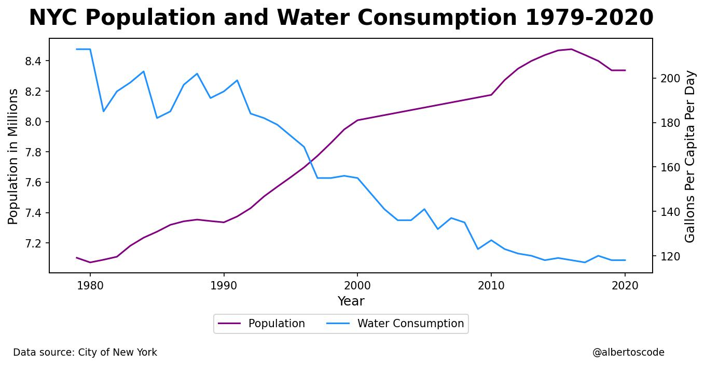

# NYC Population and Water Consumption 1979-2020

In this project, an exploration of the data was carried out, it was verified that there were no missing data, that there were no duplicates and, of course, an analysis was made.

One of the things that stands out in this analysis is how water consumption from 1979 to 2020 was reduced despite the fact that the population of New York City was increasing during this period.

Regardless of the reasons why water consumption has decreased over the years, it is important to add that without data analysis it would not have been possible to know what has happened to water consumption in this context and whether population growth could have been correlated with more water consumption.

## Chart 1

## Chart 2

## References

City of New York. (2022). NYC Open Data. Opendata.cityofnewyork.us. Retrieved 22 April 2022, from https://data.cityofnewyork.us/Environment/Water-Consumption-in-the-City-of-New-York/ia2d-e54m

Harris, C., Millman, K., van der Walt, S., Gommers, R., Virtanen, P., & Cournapeau, D. et al. (2022). Array programming with NumPy. Springer Science and Business Media LLC. 

Hunter, J. (2007). Matplotlib: A 2D graphics environment. IEEE COMPUTER SOC. 

Kanz, A. (2020). Klib. 

Kluyver, T., Ragan-Kelley, B., Perez, F., Granger, B., Bussonnier, M., & Frederic, J. et al. (2016). Jupyter Notebooks - a publishing format for reproducible computational workflows. In Positioning and Power in Academic Publishing: Players, Agents and Agendas (pp. 87-90). Netherlands; IOS Press. Retrieved 19 May 2022, from https://eprints.soton.ac.uk/403913/. 

The pandas development team. (2020). pandas-dev/pandas: Pandas. Zenodo. 

van Rossum, G. (1991). Python. Python Software Foundation. 

## Author

Alberto

- [@albertoscode](https://github.com/albertoscode)

## Feedback

If you have any feedback, please write to the following email address: ah8664383@gmail.com

